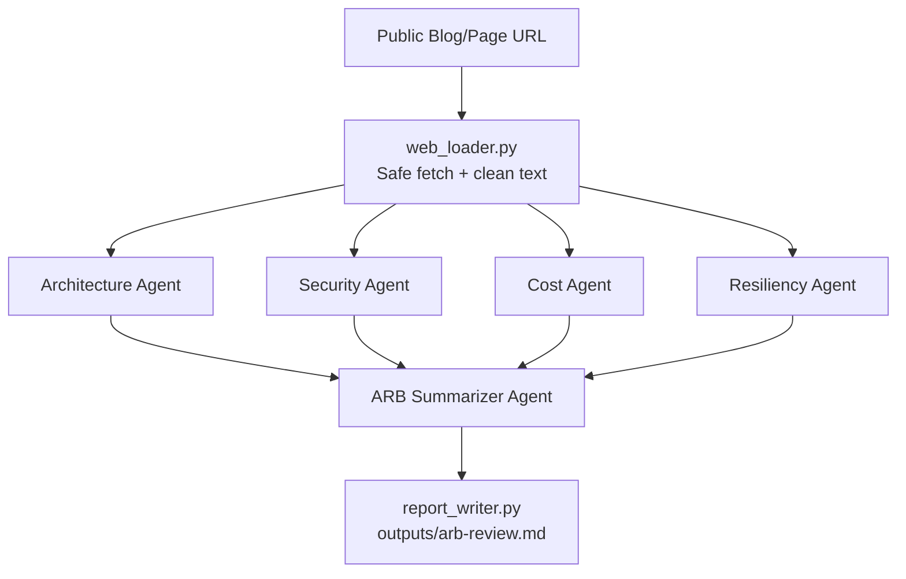
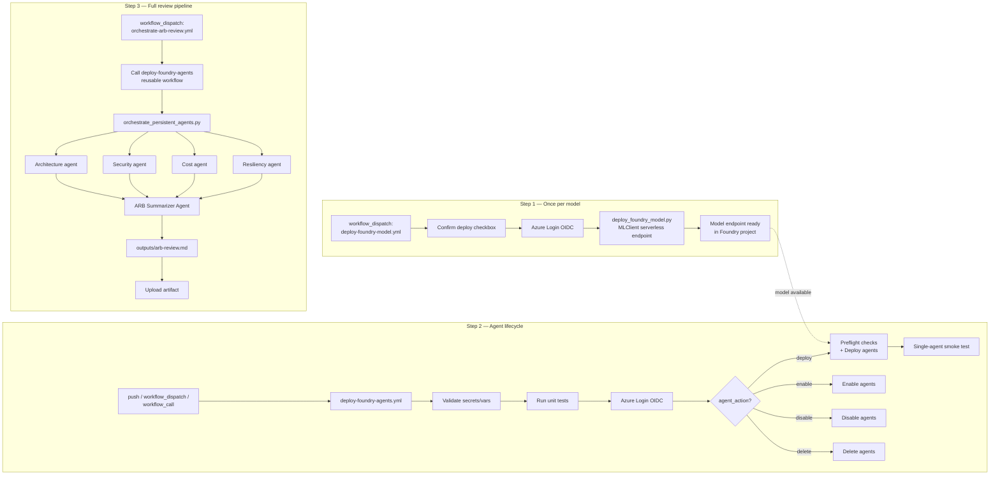
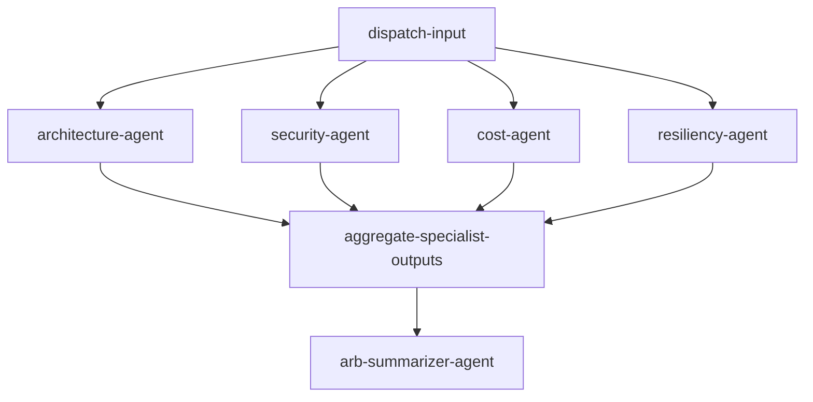

# architecture-review-board-assistant

Beginner-friendly Azure AI Foundry multi-agent learning project.

This project reviews a public blog page (or any public URL) using specialist agents and then consolidates results through an ARB Summarizer Agent.

## What this project does

- Loads a configurable public URL from `BLOG_URL`
- Safely extracts readable content (filters noise, validates URL safety, applies size limits)
- Runs parallel specialist reviews:
  - Architecture Agent
  - Security Agent
  - Cost Agent
  - Resiliency Agent
- Runs an ARB Summarizer Agent to consolidate specialist feedback
- Writes a markdown report to `outputs/arb-review.md`

## Architecture diagram



## Agent roles

- Architecture Agent
  - Reviews solution design, Azure service choice, responsibility boundaries, avoidable complexity, maintainability
- Security Agent
  - Reviews identity, managed identity usage, secret handling, RBAC, network exposure, sensitive logging
- Cost Agent
  - Reviews expensive SKUs, over-engineering, always-on resources, right-sized starter options, personal/lab subscription risks
- Resiliency Agent
  - Reviews HA/DR assumptions, regional failure posture, retry/timeout handling, observability readiness
- ARB Summarizer Agent
  - Produces final decision-oriented report:
    - Executive summary
    - Strengths
    - Key risks
    - Recommended improvements
    - Decision
    - Learning notes for first-time Azure AI Foundry learners

## Why this is a parallel multi-agent workflow

The four specialist agents are independent and can analyze the same input in parallel.
This keeps orchestration simple and demonstrates an easy-to-understand multi-agent pattern for first-time learners.

## Why v1 intentionally avoids enterprise-heavy services

This project is a focused learning exercise for Azure AI Foundry fundamentals.

For v1, it intentionally avoids:
- Azure AI Search
- Cosmos DB
- Azure Container Apps
- PostgreSQL
- App Service
- API Management
- Service Bus
- Logic Apps
- Storage Account
- Key Vault

Those are useful later, but they add complexity that distracts from first-time learning goals.

## Prerequisites

- Azure subscription
- Azure AI Foundry project
- A deployed model (recommended for learning: `gpt-4.1-mini` or another low-cost model)
- Azure CLI and login (`az login`)
- Python 3.10+
- Git
- Optional: GitHub CLI (`gh`) for repository creation from command line

## Local setup

Windows PowerShell:

```powershell
python -m venv .venv
.\.venv\Scripts\Activate.ps1
pip install -r requirements.txt
Copy-Item .env.example .env
az login
python -m src.main
```

Linux/macOS shell:

```bash
python -m venv .venv
source .venv/bin/activate
pip install -r requirements.txt
cp .env.example .env
az login
python -m src.main
```

## Configure .env

Copy `.env.example` to `.env` and set values:

```dotenv
AZURE_SUBSCRIPTION_ID=
AZURE_TENANT_ID=
AZURE_RESOURCE_GROUP=
AZURE_AI_FOUNDRY_PROJECT_ENDPOINT=
AZURE_AI_FOUNDRY_PROJECT_NAME=
AZURE_AI_FOUNDRY_MODEL_DEPLOYMENT_NAME=gpt-4.1-mini
BLOG_URL=https://<your-public-blog-or-github-pages-url>
MAX_INPUT_CHARS=12000
OUTPUT_FOLDER=outputs
LOG_LEVEL=INFO
```

## GitHub repo setup

```bash
git init
git checkout -b main
git add .
git commit -m "Initial Azure AI Foundry ARB assistant"
git checkout -b feature/azure-ai-foundry-arb-assistant
```

If GitHub CLI is not installed, create the remote later with:

```bash
gh repo create architecture-review-board-assistant --private --source=. --remote=origin --push
```

## GitHub Actions setup (OIDC only)

### Workflows

1. **`.github/workflows/deploy-foundry-model.yml`** *(run first when adding a new model)*
   - Manual-only (`workflow_dispatch`)
   - Provisions a serverless model endpoint in Azure AI Foundry via Azure ML SDK
   - Inputs: model dropdown, optional endpoint name, **confirm checkbox** (safety gate against accidental cost)
   - ⚠️ Model deployments incur ongoing cost even when idle — only deploy models you need

2. **`.github/workflows/deploy-foundry-agents.yml`**
   - CI-friendly reusable deployment workflow
   - Supports `push`, `workflow_dispatch`, and `workflow_call`
   - Validates config, runs tests, optional persistent agent deployment, and smoke checks
   - **Model dropdown** — selects from already-deployed models in your Foundry project (deploy models first using workflow 1)
   - **Agent action dropdown** — `deploy` / `enable` / `disable` / `delete`

3. **`.github/workflows/orchestrate-arb-review.yml`**
   - Wrapper workflow for end-to-end execution
   - Deploys/updates persistent agents, then invokes all specialist agents plus chairperson
   - Uploads `outputs/arb-review.md` as artifact
   - Orchestration step is automatically skipped when action is `enable`, `disable`, or `delete`

### Typical first-time setup order

```
1. Run "Deploy Foundry Model"   → provision model endpoint (once per model)
2. Run "Deploy Foundry Agents"  → create/update agents backed by that model
3. Run "Orchestrate ARB Review" → run full review pipeline
```

### Agent lifecycle management

Use the **agent action** dropdown in "Deploy Foundry Agents" or "Orchestrate ARB Review":

| Action | When to use |
|---|---|
| `deploy` | Create or update agents (default) |
| `enable` | Re-enable previously disabled agents |
| `disable` | Pause agents to save cost (agents still exist; no inference cost when not called) |
| `delete` | Permanently remove all agents and their versions |

### Required repository **secrets**

- `AZURE_CLIENT_ID`
- `AZURE_TENANT_ID`
- `AZURE_SUBSCRIPTION_ID`
- `AZURE_AI_FOUNDRY_PROJECT_ENDPOINT`
- `AZURE_AI_FOUNDRY_PROJECT_NAME`

### Required repository **variables**

- `AZURE_AI_FOUNDRY_MODEL_DEPLOYMENT_NAME`
- `BLOG_URL` (used by default deploy workflow runs)

### Optional variables

- `AZURE_RESOURCE_GROUP`
- `MAX_INPUT_CHARS`
- `ENABLE_PERSISTENT_AGENT_DEPLOY`

You must configure federated credentials in Microsoft Entra ID for your GitHub repo/branch/environment.

## Logical deployment + orchestration diagram



## Cost control notes

- Use a mini/nano model while learning
- Keep `MAX_INPUT_CHARS` bounded
- Keep prompts concise
- Avoid always-on enterprise services in v1
- Delete unused Azure resources when done

## Security notes

- Do not commit `.env`
- Do not commit secrets
- Only review public pages
- Validate URL input and block private/internal targets
- Use managed identity/OIDC in CI/CD (no client secrets)
- Do not scrape private/authenticated content

## CI deployment mode

`deploy-foundry-agents.yml` now supports:
- from-scratch project validation
- persistent agent deployment/update
- one-agent and optional multi-agent smoke checks
- reusable invocation from other workflows

Persistent Foundry agent provisioning is controlled by `ENABLE_PERSISTENT_AGENT_DEPLOY`:
- `true`: run preflight + persistent provisioning (`deploy_foundry_agents.py`)
- `false` or unset: skip persistent provisioning and run smoke-only checks

To run full persistent orchestration on demand:
- Trigger `orchestrate-arb-review.yml`
- Provide `blog_url` and optional `max_input_chars`
- Download `arb-review-report` artifact after completion

## Deploying Foundry agents (from scratch)

Run:

```bash
python scripts/deploy_foundry_agents.py
```

Prerequisites for persistent agent deployment:
- `AZURE_AI_FOUNDRY_PROJECT_ENDPOINT` must be a Foundry **project** endpoint in the form `https://<account>.services.ai.azure.com/api/projects/<project-name>`
- The CI principal (GitHub OIDC service principal) must have Foundry project publish permissions (for example **Foundry Project Manager**) at the Foundry resource/project scope

The script attempts to create/update persistent agents if your installed `azure-ai-projects` SDK supports that API shape.
If not supported, it exits gracefully and tells you to use local orchestration prompts from `src/agent_prompts.py`.

New persistent orchestration script:

```bash
python scripts/orchestrate_persistent_agents.py
```

It invokes deployed specialist agents in parallel, then calls the summarizer agent for final consolidation and writes `outputs/arb-review.md`.

## Cleanup reminder

When done learning, delete or stop Azure resources that are no longer needed to avoid ongoing costs.

## Agent Framework hosted workflow (portal Workflows replacement)

Azure AI Foundry's portal **Workflows** tab (the visual, drag-and-drop workflow builder)
is a **public preview feature that Microsoft is retiring on December 1, 2026**, and it
does not support hosted/persistent agents as workflow nodes. Because this project's ARB
review is orchestrated by persistent Foundry agents, it cannot be represented as a portal
Workflow long-term.

Instead, `src/agent_framework_workflow.py` ports the same orchestration logic to a
[Microsoft Agent Framework](https://learn.microsoft.com/agent-framework/) `Workflow` graph
— the framework Microsoft recommends as the supported, code-first successor to portal
Workflows. It builds the same fan-out/fan-in shape as
`scripts/orchestrate_persistent_agents.py`:



Each node wraps the **same persistent Foundry agents** deployed by
`deploy-foundry-agents.yml` (looked up by name via `FoundryAgent`), so agent
instructions stay single-sourced in `src/agent_prompts.py` and the Azure portal — only
the orchestration graph is re-implemented.

### Running it locally

```bash
pip install -r requirements.txt   # installs agent-framework, agent-framework-foundry,
                                   # agent-framework-foundry-hosting (prerelease packages)
export AZURE_AI_PROJECT_ENDPOINT="https://<account>.services.ai.azure.com/api/projects/<project-name>"
az login
python -m src.hosted_arb_workflow
```

This starts a local OpenAI-Responses-compatible host (`ResponsesHostServer`) on port
`8088` by default. Send a page/design description as the request text; the host runs
the same parallel-specialist → summarizer graph and returns the consolidated report.

### Deploying as a Foundry hosted agent

Follow the Foundry hosted-agent deployment flow (`azd ai agent init` /
`azd provision` / `azd deploy` / `azd ai agent invoke`) with `src/hosted_arb_workflow.py`
as the entrypoint. Because it is a **hosted agent**, not a portal Workflow, it will not
appear under the Foundry portal's **Workflows** tab — it appears under **Agents** like
the existing specialist/summarizer agents, and is invoked directly (e.g. via
`azd ai agent invoke` or the OpenAI Responses API) rather than run through the portal
workflow UI.


## Future enhancements (optional, not implemented in v1)

- Azure AI Search for RAG
- Cosmos DB for memory/state
- Container Apps or App Service for hosting
- PostgreSQL for structured review history
- Application Insights for observability
- MCP tools
- GitHub issue creation from review findings
