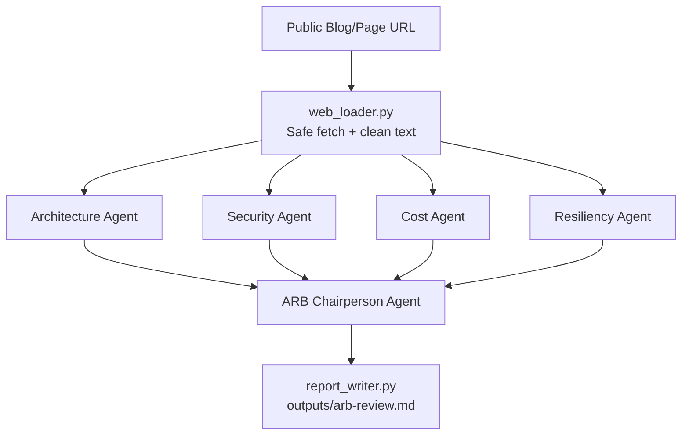

# architecture-review-board-assistant

Beginner-friendly Azure AI Foundry multi-agent learning project.

This project reviews a public blog page (or any public URL) using specialist agents and then consolidates results through an ARB Chairperson agent.

## What this project does

- Loads a configurable public URL from `BLOG_URL`
- Safely extracts readable content (filters noise, validates URL safety, applies size limits)
- Runs parallel specialist reviews:
  - Architecture Agent
  - Security Agent
  - Cost Agent
  - Resiliency Agent
- Runs an ARB Chairperson Agent to consolidate specialist feedback
- Writes a markdown report to `outputs/arb-review.md`

## Architecture diagram



## Agent roles

- Architecture Agent
  - Reviews solution design, Azure service choice, responsibility boundaries, avoidable complexity, maintainability
- Security Agent
  - Reviews identity, managed identity usage, secret handling, RBAC, network exposure, sensitive logging
- Cost Agent
  - Reviews expensive SKUs, over-engineering, always-on resources, right-sized starter options, personal/lab subscription risks
- Resiliency Agent
  - Reviews HA/DR assumptions, regional failure posture, retry/timeout handling, observability readiness
- ARB Chairperson Agent
  - Produces final decision-oriented report:
    - Executive summary
    - Strengths
    - Key risks
    - Recommended improvements
    - Decision
    - Learning notes for first-time Azure AI Foundry learners

## Why this is a parallel multi-agent workflow

The four specialist agents are independent and can analyze the same input in parallel.
This keeps orchestration simple and demonstrates an easy-to-understand multi-agent pattern for first-time learners.

## Why v1 intentionally avoids enterprise-heavy services

This project is a focused learning exercise for Azure AI Foundry fundamentals.

For v1, it intentionally avoids:
- Azure AI Search
- Cosmos DB
- Azure Container Apps
- PostgreSQL
- App Service
- API Management
- Service Bus
- Logic Apps
- Storage Account
- Key Vault

Those are useful later, but they add complexity that distracts from first-time learning goals.

## Prerequisites

- Azure subscription
- Azure AI Foundry project
- A deployed model (recommended for learning: `gpt-4.1-mini` or another low-cost model)
- Azure CLI and login (`az login`)
- Python 3.10+
- Git
- Optional: GitHub CLI (`gh`) for repository creation from command line

## Local setup

Windows PowerShell:

```powershell
python -m venv .venv
.\.venv\Scripts\Activate.ps1
pip install -r requirements.txt
Copy-Item .env.example .env
az login
python -m src.main
```

Linux/macOS shell:

```bash
python -m venv .venv
source .venv/bin/activate
pip install -r requirements.txt
cp .env.example .env
az login
python -m src.main
```

## Configure .env

Copy `.env.example` to `.env` and set values:

```dotenv
AZURE_SUBSCRIPTION_ID=
AZURE_TENANT_ID=
AZURE_RESOURCE_GROUP=
AZURE_AI_FOUNDRY_PROJECT_ENDPOINT=
AZURE_AI_FOUNDRY_PROJECT_NAME=
AZURE_AI_FOUNDRY_MODEL_DEPLOYMENT_NAME=gpt-4.1-mini
BLOG_URL=https://<your-public-blog-or-github-pages-url>
MAX_INPUT_CHARS=12000
OUTPUT_FOLDER=outputs
LOG_LEVEL=INFO
```

## GitHub repo setup

```bash
git init
git checkout -b main
git add .
git commit -m "Initial Azure AI Foundry ARB assistant"
git checkout -b feature/azure-ai-foundry-arb-assistant
```

If GitHub CLI is not installed, create the remote later with:

```bash
gh repo create architecture-review-board-assistant --private --source=. --remote=origin --push
```

## GitHub Actions setup (OIDC only)

Workflow file: `.github/workflows/deploy-foundry-agents.yml`

It uses:
- `permissions: id-token: write, contents: read`
- OIDC login (`azure/login`)
- unit tests
- deploy script
- smoke test

Required repository variables:
- `AZURE_CLIENT_ID`
- `AZURE_TENANT_ID`
- `AZURE_SUBSCRIPTION_ID`
- `AZURE_AI_FOUNDRY_PROJECT_ENDPOINT`
- `AZURE_AI_FOUNDRY_MODEL_DEPLOYMENT_NAME`
- `BLOG_URL`

Optional but supported variables:
- `AZURE_RESOURCE_GROUP`
- `AZURE_AI_FOUNDRY_PROJECT_NAME`
- `MAX_INPUT_CHARS`

You must configure federated credentials in Microsoft Entra ID for your GitHub repo/branch/environment.

## Cost control notes

- Use a mini/nano model while learning
- Keep `MAX_INPUT_CHARS` bounded
- Keep prompts concise
- Avoid always-on enterprise services in v1
- Delete unused Azure resources when done

## Security notes

- Do not commit `.env`
- Do not commit secrets
- Only review public pages
- Validate URL input and block private/internal targets
- Use managed identity/OIDC in CI/CD (no client secrets)
- Do not scrape private/authenticated content

## Deploying Foundry agents

Run:

```bash
python scripts/deploy_foundry_agents.py
```

The script attempts to create/update persistent agents if your installed `azure-ai-projects` SDK supports that API shape.
If not supported, it exits gracefully and tells you to use local orchestration prompts from `src/agent_prompts.py`.

## Cleanup reminder

When done learning, delete or stop Azure resources that are no longer needed to avoid ongoing costs.

## Future enhancements (optional, not implemented in v1)

- Azure AI Search for RAG
- Cosmos DB for memory/state
- Container Apps or App Service for hosting
- PostgreSQL for structured review history
- Application Insights for observability
- MCP tools
- GitHub issue creation from review findings
